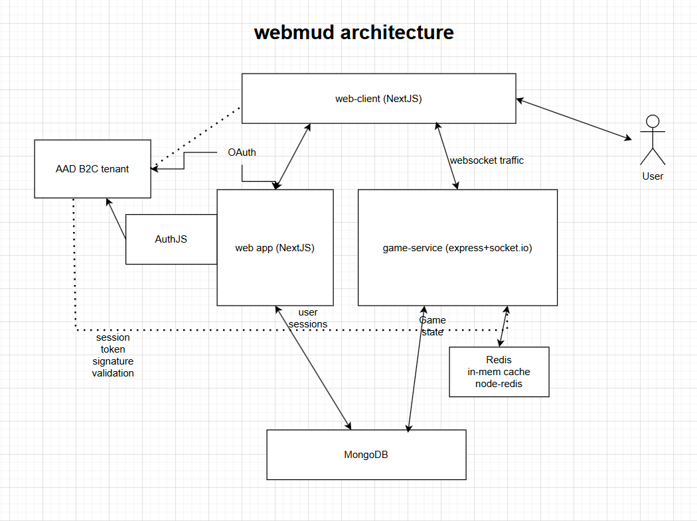

# webMUD

This project is an interactive web-based MUD built with a modular, scalable architecture.

## Features
- Real-time multiplayer gameplay
- Old-school command line gameplay and socials
- Play through the browser
- Scalable architecture could support many concurrent users/large battles
  
## Architecture



webMUD code is written primarily with Typescript and employs a classic client-server architecture. Instances of a given game world run from a "game server" and players connect to these worlds from a web application. The game world stores persistent data in MongoDB. 

### Client
webMUD's [client](./webmud_client/README.md) is a NextJS single page app (SPA) (./webmud_client/README.md) that players use to login, create characters, and connect to game servers. 

### Server
Express.js and socket.io

## Azure Deployment

Azure Developer CLI can be used to deploy webMUD to Azure, with the following resources deployed.

- Azure Container Apps
- Azure Cosmos DB
- Microsoft Entra ID - External Identities
- Azure Container Registry
- Azure DNS

Run ```azd up``` after creating a parameters file to deploy to Azure.

## Development

- Setup node 23 via nvm
- Start mongodb via ```docker compose up -d```
- Start the game service and web clients with ```npm run dev``` in their respective folders